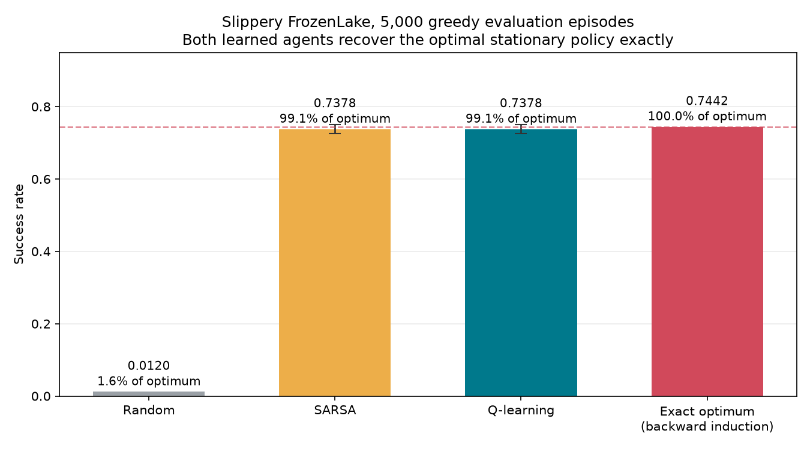
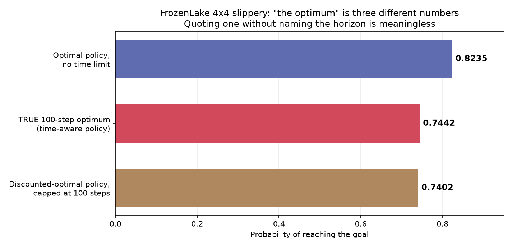
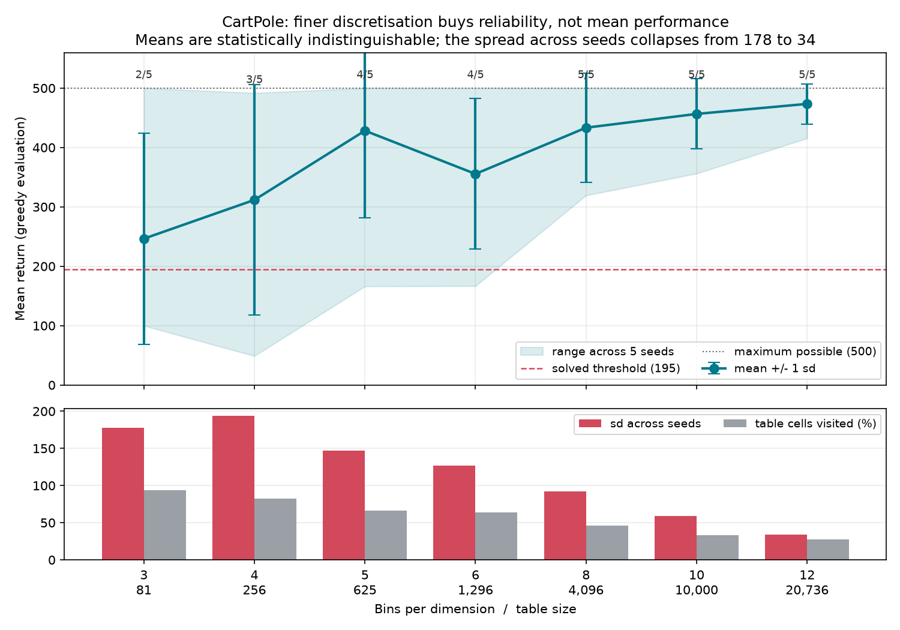

# Tabular reinforcement learning, and what "optimal" actually means

[](https://github.com/JosElias23/rl-from-scratch/actions/workflows/ci.yml)
[](https://github.com/JosElias23/rl-from-scratch/actions/workflows/ci.yml)
[](pyproject.toml)
[](LICENSE)

**English** · [Español](README.es.md)

Q-learning and SARSA written from first principles, no RL library anywhere, and
measured against optima computed exactly by dynamic programming rather than
against numbers quoted from the internet.

The algorithms are the easy part. The interesting work is deciding what to
compare them to, and this project's main result is that the figure everyone
quotes for "optimal" on FrozenLake is the answer to a different question.

---

## Results

### FrozenLake 4x4, slippery, 5,000 greedy evaluation episodes

| Agent | Success rate | 95% CI | % of exact optimum | Agreement with optimal policy |
|---|---:|:--|---:|---:|
| Random | 0.0120 | — | 1.6 % | — |
| SARSA | 0.7378 | [0.7254, 0.7498] | 99.1 % | **100 %** |
| Q-learning | 0.7378 | [0.7254, 0.7498] | 99.1 % | **100 %** |
| _Exact optimum (backward induction)_ | _0.7442_ | _exact_ | _100 %_ | — |



Both agents recover the optimal **stationary** policy exactly. Every one of the
16 states gets the action value iteration chose. Their measured success rate
equals what that policy scores when simulated, to four decimal places.

The remaining 0.64 percentage points are not a training failure. They are
precisely the value of knowing how much time is left, which no stationary policy
can represent. More on that below.

---

## The main finding: "the optimum" is three different numbers



The figure usually quoted for optimal play on slippery 4x4 FrozenLake is about
**74 %**. That number is not a property of the environment. Value iteration on
the published transition model gives:

| Question being asked | Exact answer |
|---|---:|
| Best achievable, no time limit | **0.8235** (= 14/17) |
| Best achievable within 100 steps, policy may use the clock | **0.7442** |
| The unbounded-optimal policy, interrupted at 100 steps | 0.7402 |

All three are correct. They answer different questions, and quoting one without
naming the horizon is meaningless.

Why the time limit costs so much. The optimal policy is deliberately slow. It
hugs walls and accepts sideways slides so that no unlucky slip can push it into
a hole, which means crossing a 4×4 grid often takes far more than 100 steps.
Gymnasium's default `TimeLimit` truncates those eventual successes:

```
horizon    50   ->  0.5356
horizon   100   ->  0.7402      <- the commonly quoted "~74%"
horizon   200   ->  0.8164
horizon   500   ->  0.8235
unbounded       ->  0.8235
```

**Why a stationary policy cannot reach even the 100-step optimum.** A policy
that knows it has ten steps left should stop playing safe and gamble on a direct
dash. The optimum for a time-limited objective is therefore *non-stationary*,
and backward induction finds it:

```
V_0(s) = 0
V_k(s) = max_a  sum_s'  P(s'|s,a) [ r(s,a,s') + V_{k-1}(s') ]
```

That policy scores 0.7442 against the stationary policy's 0.7402. The behaviour
is visible directly: from the start state with 100, 50 or 20 steps remaining it
plays action `Left`; with 10 remaining it switches to `Right` and runs for it.

Both figures are verified against 20,000 simulated episodes, and CI recomputes
all three on every push. `tests/test_planning.py` asserts that backward
induction agrees with simulating the resulting policy. If the ceiling were
wrong, every percentage in this README would be wrong with it.

> **This corrects a claim I had previously made about my own work.** A CV bullet
> of mine described 73 % on this task as "nearly the theoretical optimum (~74
> %)". The 74 % figure is the 100-step ceiling, and the theoretical optimum is
> 82.35 %. The accurate statement is the stronger one: the agent recovers the
> optimal stationary policy exactly and scores 99.1 % of what any policy could
> achieve under the same time limit.

The decision log, including the single-seed result that had to be corrected, is
in [`docs/DECISIONS.md`](docs/DECISIONS.md).

---

## CartPole: what a continuous state space costs

CartPole has no finite state space, so the four real-valued observations are
quantised into a table. That quantisation is the whole engineering problem.

Every agent trained here clears the classic "solved" bar of 195 mean return
comfortably, and the best configurations sit at the 500-step truncation ceiling.
The interesting question is therefore not whether tabular methods can solve
CartPole -- they can -- but how reliably, and what the discretisation costs.

### Resolution buys reliability, not mean performance



The textbook argument predicts an inverted U: too few bins and distinct
situations collapse into one cell; too many and no cell is visited often enough
to converge. Seven resolutions × five seeds each, 60,000 episodes per run:

| Bins | Table cells | Cells visited | Mean return | sd across seeds | Range | Seeds solved |
|---:|---:|---:|---:|---:|:--|---:|
| 3 | 81 | 94 % | 246.4 | **177.7** | 100–500 | 2/5 |
| 4 | 256 | 82 % | 311.7 | 193.7 | 49–492 | 3/5 |
| 5 | 625 | 66 % | 428.3 | 146.7 | 166–500 | 4/5 |
| 6 | 1,296 | 64 % | 355.6 | 126.8 | 167–500 | 4/5 |
| 8 | 4,096 | 46 % | 433.4 | 91.8 | 319–500 | 5/5 |
| 10 | 10,000 | 33 % | 456.6 | 59.1 | 356–500 | 5/5 |
| 12 | 20,736 | 27 % | **473.4** | **33.8** | 415–500 | 5/5 |

The second half of the textbook story never arrives. At 12 bins the agent visits
27 % of 20,736 cells and is still the best configuration tested, and the only
one that never fails. Unvisited cells turn out to be *unreachable* states, not
neglected ones: a pole at 20° with the cart accelerating the other way is a
configuration the dynamics never produce. Finer bins mostly subdivide empty
space.

What resolution actually buys is **reliability**. The means from 4 to 12 bins
are statistically indistinguishable; the standard deviation across seeds
collapses from 177.7 to 33.8. Coarse discretisation does not give a worse agent
on average; it gives a lottery. Three bins solved the task twice in five runs
and scored 100 in another.

An earlier single-seed version of this sweep produced 499.8 at 3 bins, 38.7 at
4, and 500.0 at 5. That is not a curve; it is noise, and it is why this
experiment reports seeds rather than runs.

### Q-learning versus SARSA: an honest non-result

Eight seeds each at six bins per dimension, 60,000 episodes per run, greedy
evaluation on 300 episodes:

| Agent | Mean | sd | Median | Range | Seeds solved |
|---|---:|---:|---:|:--|---:|
| **Q-learning** | **432.1** | 87.5 | 477.7 | 276–500 | **8/8** |
| SARSA | 302.3 | 125.6 | 325.2 | 121–500 | 6/8 |

Paired over the seeds they share, Q-learning leads by **+129.8 return, 95 % CI
[−15.0, +274.6]**. The interval covers zero.

So the honest answer is that this experiment cannot separate them. The point
estimate and the solve counts both favour Q-learning, and the direction is
consistent with theory. Q-learning learns the greedy policy's value regardless
of exploration, while SARSA's on-policy target keeps punishing it for the
ε-greedy moves that end an episode. But eight seeds against a standard deviation
near 100 is not enough power to call it, and a README that claimed a winner here
would be claiming something that does not replicate.

The evidence for that is in this repository's own history. A single-seed run
scored Q-learning 408.41 and SARSA 500.00, the reverse of the eight-seed
ranking. An earlier run, before the random-stream bug was fixed, scored
Q-learning 500.00 and SARSA 294.07. Three experiments, three different stories,
one underpowered design.

---

## Method

### The algorithms

Both are four-line update rules, written out rather than imported.

```
Q-learning   Q(s,a) <- Q(s,a) + a [ r + g max_a' Q(s',a') - Q(s,a) ]
SARSA        Q(s,a) <- Q(s,a) + a [ r + g       Q(s',a')  - Q(s,a) ]
```

The single differing term is the whole distinction: Q-learning learns the value
of the greedy policy no matter how badly it explores, SARSA learns the value of
the policy it is actually following, exploration mistakes included. A test
asserts they diverge when the next action is suboptimal and agree when it is
greedy.

### Three bugs this project documents

Terminal states must not bootstrap. `r + γ·V(s')` past a terminal state invents
value that does not exist. On a sparse-reward task it makes the agent
confidently wrong, and nothing raises.

Ties must break randomly. With a zero-initialised table every action ties.
`argmax` returns index 0 every time, so the agent explores far more slowly than
ε alone implies. A silent bug that merely looks like slow learning.

Evaluation must not consume the training random stream. Greedy action selection
still needs randomness for tie-breaking. It was drawing from the training
generator, so inserting a periodic evaluation shifted every subsequent training
decision. Found by noticing two runs with identical seeds and hyperparameters
disagreed, 500.00 with periodic evaluation, 288.47 without. Measuring the agent
was changing the agent. `tests/test_agents.py` now pins it.

### Evaluation protocol

- **Training curves are never reported as results.** An ε-greedy agent is
  deliberately making random moves; its training return understates the policy
  it has learned. Every number here comes from greedy evaluation with learning
  disabled.
- **Evaluation episodes are seeded from a separate offset**, so agents are
  scored on environment realisations they did not train against, and on
  identical ones as each other.
- **Success rates carry Wilson intervals**, not the normal approximation, which
  misbehaves at rates far from 0.5 on a few hundred episodes.
- **Exact optima come from dynamic programming**, and are cross-checked against
  simulation in the test suite and in CI.

---

## Reproducing these numbers

```bash
git clone https://github.com/JosElias23/rl-from-scratch.git
cd rl-from-scratch
python -m venv .venv && source .venv/bin/activate   # Windows: .venv\Scripts\activate
pip install -e ".[dev]"
```

```bash
python -m pytest                     # 37 tests
python scripts/train_frozenlake.py   # ~4 minutes
python scripts/train_cartpole.py     # ~25 minutes
python scripts/sweep_resolution.py --workers 12   # 35 runs, parallel
python scripts/compare_agents.py --workers 12     # 16 runs, parallel
python scripts/make_figures.py
```

The sweeps spread runs across processes; on twelve workers each takes roughly
half an hour. Everything else is minutes.

---

## Repository layout

```
rl-from-scratch/
├── configs/default.yaml       every hyperparameter that moves a number
├── src/rlfs/
│   ├── agents.py              Q-learning, SARSA, random baseline
│   ├── planning.py            value iteration and backward induction
│   ├── discretize.py          continuous observations to table indices
│   ├── training.py            training loop and greedy evaluation
│   └── utils.py               seeding, config, JSON reporting
├── scripts/
│   ├── train_frozenlake.py    agents against the exact ceiling
│   ├── train_cartpole.py      agents on the discretised task
│   ├── sweep_resolution.py    resolution vs performance, multi-seed
│   ├── compare_agents.py      Q-learning vs SARSA, paired over seeds
│   └── make_figures.py        every figure in this README
├── tests/                     37 tests
└── reports/                   metrics as JSON, figures as PNG
```

---

## Limitations and next steps

**Tabular only.** No function approximation, so nothing here scales past toy
state spaces. That is the point of the project, not an oversight, but it is the
first question an interviewer should ask.

**CartPole hyperparameters are not tuned.** Learning rate, discount and the ε
schedule are standard values applied identically to both agents. Fair as a
comparison, certainly not optimal for either.

**The discretisation bounds are hand-set.** Gymnasium reports the two velocity
dimensions as unbounded, so the ranges here are the empirical operating region
of a controlled pole. A different choice would move every CartPole number.

**FrozenLake is 4×4.** The 8×8 map is a meaningfully harder exploration problem
and is not attempted.

**No eligibility traces, no double Q-learning, no prioritised replay.** Each is
a small addition to this code and each would need the same multi-seed treatment
to say anything honest about.

### Planned

- Q(λ) with eligibility traces, and whether it survives the seed variance
- The 8×8 FrozenLake map, where naive ε-greedy exploration should start to fail
- A non-stationary tabular agent on CartPole with time-to-truncation in the
  state, to test whether the FrozenLake result transfers

---

## License

MIT, see [LICENSE](LICENSE). 